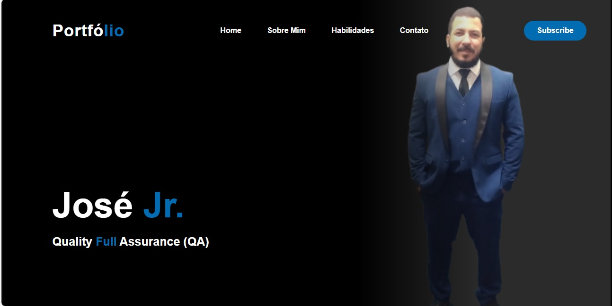
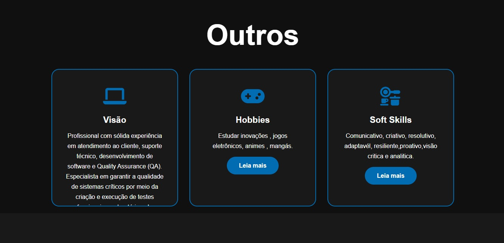

🌐 Portfólio Online — José Jr.

  

📌 Sobre o Projeto

Este projeto é um currículo online interativo, desenvolvido em HTML5 e CSS3, com design moderno e totalmente responsivo.
O objetivo é servir como vitrine profissional, apresentando habilidades técnicas, trajetória, valores e formas de contato de maneira clara e objetiva.

👉 O Portfólio destaca meu perfil como QA e Desenvolvedor Web, unindo práticas de acessibilidade, responsividade e organização de código.

✨ Funcionalidades

Home: Apresentação pessoal e título profissional.

Sobre Mim: Descrição detalhada da trajetória, visão e objetivos.

Habilidades: Lista de hard skills (tecnologias) e soft skills (competências pessoais).

Contato: Links para redes sociais e meios de contato direto.

Design moderno e responsivo: Adaptado para desktop, tablet e mobile.

Interatividade: Botões clicáveis, links externos e ícones personalizados.

Ícones e fontes: Uso de Font Awesome e Google Fonts para melhorar a experiência visual.

🧱 Estrutura do Projeto

curriculo_web/
 ├── css/
 │    └── style.css
 ├── img/
 │    ├── about.jpg
 │    ├── contato.jpg
 │    ├── habilidades.jpg
 │    ├── demo1.png
 │    ├── demo2.png
 │    └── ...
 ├── contato.html
 ├── habilidades.html
 ├── index.html
 ├── sobreMin.html
 └── README.md
 

🛠️ Tecnologias Utilizadas

HTML5 — Estrutura semântica das páginas

CSS3 — Estilização, responsividade e design visual

Font Awesome — Ícones customizados para redes sociais e seções

Google Fonts — Tipografia moderna e legível

🚀 Como Visualizar o Projeto
✅ Pré-requisitos

Navegador web moderno (Google Chrome, Firefox, Edge, etc.)

▶️ Executar localmente

Clone o repositório:

git clone https://github.com/joseGuiomarJr

Abra o arquivo index.html diretamente no navegador.

Navegue entre as páginas: Home, Sobre Mim, Habilidades, Contato.

📸 Demonstração

   

🌟 Impacto e Objetivo

Este portfólio é uma ferramenta de apresentação profissional, pensada para:
✔️ Recrutadores que buscam identificar habilidades de forma prática
✔️ Mostrar competências técnicas (HTML, CSS, boas práticas de UI/UX)
✔️ Evidenciar habilidades interpessoais (organização, visão crítica, comunicação)
